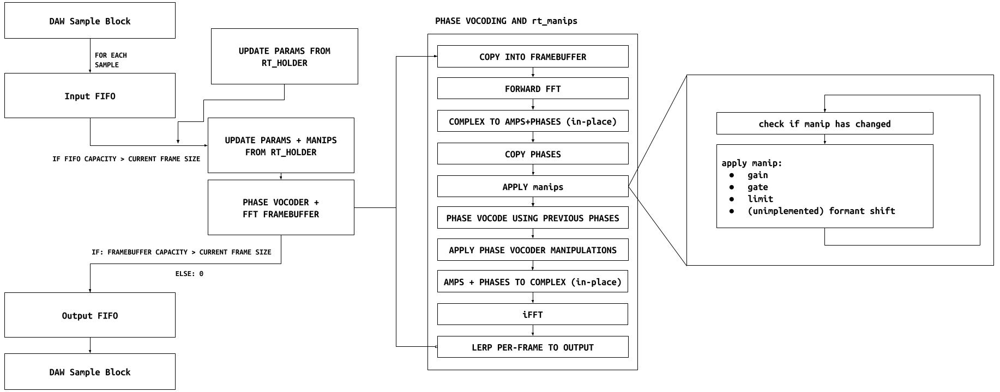

\pagebreak
# Acknowledgements
\pagebreak

# Abstract
- What is it?
  - Pure C Library
  - A core STFT algorithm with several methods for manipulation
    - Per-bin manipulations, i.e. gating, limiting, muting
    - Phase vocoder based pitch-shifting
    - Freeform phase manipulation for effects akin to phase chorus
    - More to come...
  - A scripting language, rt_cmd, for precise control of these parameters
    - Includes a custom command parser
- What can it do?
  - User level manipulation of FFT bins, both amplitude and phase
    - Sonically akin to filtration, but with audible artifacts that can be creatively exploited
  - Methods for adjusting the phase vocoder algorithm for creative results
    - phase chorus
    - "robotization", but with more control
  - Intended for users to get in deep and experiment with + corrupt their sounds

# Background & History
## Motivation and philosophy behind creation
- Digital audio is stuck trying to emulate and outperform analog gear
- Very little emphasis on exploring the creative possibilities that are unique to digital sound processing algorithms
- Few spectral plugins that aren't extremely nebulous about their actual internal function
- Very few creative plugins in general that emphasize surgical precision
- Absolutely no spectral plugins that allow direct interface with their underlying algorithms (to my knowledge)
  - RTSTFT is designed for user-level manipulation of individual FFT bins
- Also intended as a lightweight and friendly introduction to command-line syntax
  - A skill I think everyone deserves to be taught but lacks easily available resources for beginners
## History of spectral audio
- Fourier transform began as a method for thermodynamic analysis
- Equalizers began as audio applications of principles used in electrical engineering
  - By their nature, smooth and somewhat imprecise (which is generally pleasing to the ear)
- Vocoders may be the first discretized audio processor
  - Utilized filters to isolate frequency bands for individual processing
- With the advent of modern computers, the DFT could be performed real-time
  - H910 Harmonizer
  - AutoTune (started out as oil location)
  - Phase vocoding for cell phones
  - JPEGs! (DCT)


# Mathematics

For this section explaining the math behind RTSTFT, I will be using *extremely* explicit notation, and explaining concepts that may seem trivial or unnecessary to those with more experience with the maths used. I do so in order to create an explanation that I wish had existed when I was learning all of this on my own. The technical parts of this paper are intended for a anyone with only a fuzzy recollection of highschool level calculus, and insist upon instilling the reader with a deep understanding of the actual mechanisms and reasoning behind the math instead of just the computations alone. This does result in much lengthier, wordier explanations, but I hope it will also lead to the paper being more accessible to anyone learning these concepts on their own.

## An Overview of the Fourier Transform

For some set of $N$ input values $x_{input}$, the Discrete Fourier transform (DFT) will return an array of values $x_{output}$ at an index $k$ defined as\footnote{For those who may not know: the sigma symbol $\sum$ simply indicates adding up the values of an expression for all integers in the given range. As such, $\sum_{n=0}^{N - 1}f(n)$ simply indicates determining the output of $f(n)$ for all $n$ from $0$ to $N -1$, and then summing all these values together.}:

$$\displaystyle x_{output}[k] = \sum_{n=0}^{N - 1}{x_{input}[n] \cdot e^{\frac{i2\pi kn}{N}}}$$ 


Note that this set of input values, or "signal" as it will be hereon referred to, is zero-indexed, hence taking the sum from 0 to N-1. This equation may certainly seem a little daunting, but we can break it down a bit by noting that it shares the form of Euler's formula, $e^{ix} = \cos{x} + i\sin{x}$. Applying this, we get the following\footnote{Wikipedia}:

$$\displaystyle x_{output}[k] = \sum_{n=0}^{N - 1}{x_{input}[n] \cdot (\cos(\frac{i2\pi kn}{N}) + i\sin(\frac{i2\pi kn}{N}))}$$

Though this seems no less complicated, it tells us something very fundamental about the equation: it is returning a value that lies on some circle where the x-axis is real and the y-axis is imaginary. The DFT imagines the input signal as some addition of many different harmonic sine waves, where the lowest frequency sinusoid has a frequency of 1/N samples, and the highest a frequency of 2 samples. The inner portion of the equation, $x[n] \cdot \frac{i2\pi kn}{N}$, can be interpreted as the complex "response" of a given frequency $\frac{1}{k}$ at a given sample $n$, with the sum of all these complex numbers representing the response

What matters is, when we take the absolute value and the angle of a complex number at some index $k$ of $x_{output}$ (corresponding to taking the radius and the angle of the complex number on its imaginary circle), the values we get back are the amplitude and the phase of the sinusoid with the frequency $\frac{1}{k}$ samples. 

Let me state that again in simpler terms, for emphasis: ***the DFT decomposes any input signal into a set of sinusoid waves, and gives us the phase and amplitude of each of those sinusoids***. This mathematical operation is not an estimation: it is 100% accurate and completely reversible. Even for people familiar with the DFT, the significance of this cannot be overstated: being able to decompose a signal like this, turning its time-domain information into frequency-domain information, is an invaluable tool in almost any field of mathematics that deals with periodic signals. This explanation still might not suffice for many, as even I still have trouble fully linking the variables in the equation to what's actually going on under the hood. I insist you go to 3blue1brown's YouTube Channel\footnote{3Blue1Brown} and take a look at his video on the DFT; I find the visualizations to be extremely helpful in building a deeper understanding of how the DFT really works.

The DFT lies at the core of countless more complex signal processing algorithms, such as the ones that lie at the heart of RTSTFT: the phase vocoder, and the short-time Fourier transform upon which it depends.

## The Short-Time Fourier Transform

The short-time Fourier transform (STFT) is a method of extracting data about how the phase and frequency distribution of a signal changes over time. This is achieved by taking overlapping sections of an incoming signal, which is called *windowing*, and performing a Fourier transform on each of these windowed frames. Practically, this is generally done using a fast Fourier transform (FFT), which is an optimized version of the normal DFT that takes advantage of symmetries in the math that can be ignored when working with real-valued input signals. 

The STFT is often performed on overlapping frames of signal, with the factor of the overlap $F_{overlap}$ determining how much the samples frames overlap. This overlap distance, defined as the frame size $N$ divided by $F_{overlap}$, is referred to as the "hop," as it is the distance the algorithm hops to get from one frame to the next. As an example, an STFT with $F_{overlap} = 4$ and $N = 1024$ would take a 1024-sample frame from the input signal every 256 samples. A long input signal of 4096 samples, when run through this STFT, would return 13 windowed frames, each sampled 256 samples apart from each other.

These overlapping frames will also have a *windowing function* applied to them \footnote{Götzen et. al.}. This reduces the power of samples at the edges of the frames, and tends to increase the precision of the STFT. The Hanning window is the most commonly used of these:


Though the STFT is excellent for producing visualization and other analyses of long or real-time signals that would defy easy analysis via a single FFT, their real power becomes apparent when their tiered nature is leveraged to perform complex manipulations on the input signal that would otherwise be impossible.

For a signal that is comprised of $M$ overlapping frames of size $N$, any frame $m \in \{0, ..., M - 1\}$ in the array of analysis frames $A$\footnote{We denote these frames as "analysis" frames as they represented the analyzed amplitude and phase information from the incoming signal. This distinction will be very important when we start modifying the frames using phase vocoding.} is defined by the following equation:

$$A_{m}[k] = (\sum_{n = 0}^{N-1}{
       x_{input}[n] \cdot e^{\frac{i2\pi kn}{N}}) \cdot w[n] 
}$$

for the output fra $x_{frame}$ in the input sequence $x_{input}$, and the windowing function $w[n]$ for the given sample $n$. 

To reconstruct the input signal, one need only add the frames back together in the same order they were extracted, an operation defined as such:

$$x_{output}[n] = \sum_{i=0}^{m-1}=A_{i,(n - \text{hop}_a)} \cdot w[n] \cdot (u[n - i * \text{hop}_a] - u[n - i * \text{hop}_a - N])$$


where $\text{hop}_a$ is the hop size calculated as $\text{hop}_a = \frac{N}{F_{overlap}}$, and $u[n]$ is the unit step function, defined as:

$$u[n] = \begin{cases} 1 & n \ge 0 \\ 0 & n < 0 \end{cases}$$


In this context, the unit step function is simply used to excluded any of the frames that aren't overlapping the current frame $m$. This entire reconstruction operation is known as "overlap-adding," as it is quite literally summing the overlapping frames back together. Note how we also re-apply the windowing function during the overlap-add: during the extraction phase, the window is used as it helps increase the resolution of the FFT, while the windowing during the overlap-add ensures a smooth transition between overlapping frames.

 Next, we'll look at how using an hop size during overlap-adding that is different from the one used during frame extraction can allow for pitch-shifting and time-stretching, as well as how the phase vocoder corrects the phase issues that arise from doing so.

## Phase Vocoder

The phase vocoder is an algorithm that allows for frequency-domain manipulation of signals while keeping the time domain constant. Most likely, you'll know that speeding up audio, like when you change the rotational speed of a record player, changes the pitch. What a phase vocoder can do is change the overall time of a signal while keeping the pitch constant, or change the pitch while keeping the time constant. The way it does this is by ensuring that the phases of each individual sinusoid, or "bin", aligned between the frames. In short, a phase vocoder does this by taking the phase of each bin and adjusting it using the phase of the same bin from the previous frame. 

Time-stretching with an STFT can be accomplished by simply overlap-adding the windowed frames with a different hop size—e.g., the same 1024/256 STFT mentioned above could make its input audio twice as long by simply re-layering the frames 512 samples apart as opposed to the original 1024. To pitch-shift, one need only resample this audio to its original length; for instance, an audio clip stretched to twice its length could be resampled to its original length to shift its pitch up one octave. We can call this two hop sizes $\text{hop}_a$ (the *analytical* hop size) and $\text{hop}_s$ (the *synthetic* hop size). The difference between these two sizes can be referred to as the "stretching factor," which will be notated as $S$ in this paper. 

Unfortunately, using this technique when overlap-adding introduces some issues. Namely, the STFT does not perfectly account for changes in frequency between frames when said frequency exists somewhere between bins: this is called the "phase coherence" problem \footnote{Srinivas et. al.}. Imagine a very simple STFT that has bins evenly spaced 1Hz apart (we'll assume these frames are exactly 1 second long, for simplicity). If one frame possesses a sinusoid at 1.8Hz, while the subsequent one changes in pitch to 2.2Hz, both of these sinusoids will be "detected" by the 2Hz bin. The issue arises from the fact that the 2Hz bin "assumes" a perfect 2Hz sinusoid, which will fail to accurately represent the phase difference between the two frames if the distance between them is changed, such as in a time-stretch/pitch-shift operation. 

This is where the phase vocoder comes in. Using the phase information from the current bin and the previous bin, it calculates the "true" frequency that is being detected by each bin, which eliminates the phase coherence problem \footnote{Ibid.}.

### Phase Vocoder - Mathematical Preface

Before beginning, in the spirit of being unnecessarily explicit in the technical explanations in this paper, allow me to clarify several things that were difficult for me to grasp as someone who didn't have much exposure to academic-level DSP symbology.

In the following equations, there are two symbols that you may find intimidating: the Greek letters $\phi$ and $\omega$ (phi and omega). $\phi$ is used to denote a phase angle, i.e. the current "position" of a waveform, where as $\omega$ is the angular frequency, which is essentially just the cyclic frequency multiplied py $2\pi$ radians. For instance, if we look at the following sine wave:


First off, we notice that this sine wave cycles twice over the course of its period, which gives it an angular frequency of $\omega = 2 * 2\pi = 4\pi$. We also note that the waveform initially moves downward, implying that it has been shifted over (as a normal sine wave initially proceeds upwards). As such, we say its phase angle, $\phi$, is equal to the amount it has been shifted to the left. In this case, the sinusoid begins at the point that would've corresponded to $\frac{\pi}2$ radians on the un-shifted waveform, giving this waveform a phase angle $\phi = \frac{\pi}2$.

The other main confusion I found in the notation surrounded the difference between the mathematics provided and the actual implementation in the code. A musician's instinct would be to qualify these separate waveforms as frequencies relative to their sampling rate, e.g. some sinusoid that cycles once over 1024 samples at a sample rate of 44.1kHz should be considered mathematically as an 46.06Hz wave. However, mathematically, the Fourier transform is agnostic of our real-world audio frequencies, and instead only cares about the angular frequency *relative to sample rate*; i.e., the FFT is only concerned with how many times a waveform cycles over the number of samples it's being performed. For example, the sinusoid present in the first bin of our 1024-sample FFT from above will not be represented in the math as 46.06Hz, but instead simply as a wave with $\phi = 2\pi$. 

One rather simple but vital piece of information is that frequencies are spread evenly across FFT bins, but for any FFT, half of the bins represent useless values in the context of audio bins, as the frequencies are not spread from 0 to the max frequency, but instead 0 to the *sample rate*. Technically, all the bins above the bin N/2 represent negative frequencies as the Fourier transform is bidirectional, but in the context of real-valued audio samples these can safely be ignored.\footnote{This is because for real-valued Fourier transforms, the bins are symmetric around the N/2 bin. This is one of the mathematical symmetries that is used to implement fast Fourier transform algorithms.}

The frequency for any FFT bin $k$ is $\frac{k \cdot \text{sample rate}}{N}$. Because the FFT is agnostic of what the real-world frequencies are, we can choose arbitrary values for sample rate as long as we keep our math consistent. In order to keep the amount of mathematical operations to a minimum, it is advantageous to calculate time in terms of frames, as opposed to seconds. By this definition, the lowest FFT bin would have a frequency of 1 cycle per frame, or an angular frequency of $\phi=\frac{2\pi\space\text{rads}}{\text{frame}}$.

This may be a little daunting, but I believe the information provided above will be enough for anyone with the patience to puzzle it out for themselves—I simply wished to illustrate concepts that I felt were not made clear in the resources I used, to the point where my math was faltering simply because I didn't understand the difference between, for instance, audio frequency and angular frequency. 


With that out of the way, we can now get into the math of the phase vocoder itself.

### Definition

The main goal of the phase vocoder is to calculate the *true* frequency that is being detected by each bin, not just the "ideal" frequency we obtain as $\omega_{ideal}[k]=2\pi{k} \frac{\text{rads}}{\text{frame}}$.\footnote{These ideal frequencies are identical for any all frames, hence the omission of the $m$ index.} To start this process, we must first find the phase shifts for each bin between the current frame and the previous frame. Please refer to the excellent web article\footnote{Grondin} in my sources for some great visualizations of this process, although note that the math here is done a little differently. The phase shift, $\Delta\phi$, is simply the difference in $\phi$ between two bins of two adjacent frames, so we can determine it as such:

$$\Delta\phi_{m}[k]=\phi_{m}[k] - \phi_{m-1}[k]$$

where $\phi_{m}[k]$ indicates the phase of bin $k$ for frame $m$. 

We can now calculate the deviation of the real, measured frequency from the ideal frequency by first calculating an "ideal phase shift" as $\Delta\phi^{ideal}_{m}[k] = \frac{\omega^{ideal}[k]}{F_{overlap}}$, which is the amount of phase offset one would expect if it had the ideal angular frequency.\footnote{This is because of the fact that the distance between two frames is simply $\frac{\text{frame size}}{F_{overlap}}$, and that our time units are measured relative to frames as opposed to seconds.} Using this, we can find the *deviation* of the real frequency from the ideal frequency, $\Delta\omega$, as the difference between the calculated and the ideal phase shifts:

$$\Delta\omega_{m}[k] = \Delta\phi_{m}[k] - \Delta\phi^{ideal}_{m}[k]$$

Using this value, we can obtain our estimate of the true frequency as:

$$\omega^{true}_{m}[k] = \Delta\omega_{m}[k] + \omega^{ideal}[k]$$

Because the FFT only deals in wrapped phases, i.e. phases that are constrained to the range $[-\pi, \pi]$, we must ensure that this true frequency is also appropriately constrained to this range. We can do this by defining a simple wrapping function\footnote{Lim}:

$$ \text{wrap}(\phi) = \phi - \text{round}(\frac{\phi}{2\pi})\cdot 2\pi;$$
$$\omega_{m}^{wrapped}[k] = \text{wrap}(\omega^{true}_{m}[k])$$

And there we have it! We have an accurate, wrapped estimation of the true angular frequency\footnote{One vital caveat here is that our $\omega_{wrapped}^{m}[k]$ is not in terms of $\frac{\text{rads}}{\text{frame}}$, but rather $\frac{\text{rads}}{\text{overlap}}$. We could get the estimation of the true frequency in $\frac{\text{rads}}{\text{frame}}$ simply by multiplying $\omega_{wrapped}$ by $F_{overlap}$, but that would be an unnecessary computation as we need the angular frequency in terms of the overlap length for the final calculation anyways.}, which we can then employ to correct the phase coherence issues by calculating a new, synthetic phase $\phi_{s}$ for each bin like so:

$$\phi_{m}^{s}[k] = \text{wrap}(\phi_{m-1}^{s}[k] + \omega^{wrapped}_{m-1}[k] \cdot S)$$

Note how we multiply our wrapped frequency estimate by the stretching factor—this is why the phase vocoder is so vital. Without it, we would have absolutely no way of making a good estimate where the phase of this bin will be when it is stretched, because all we get are the "ideal" frequencies obtained from the FFT. Furthermore, this is why we use synthetic phase and true frequency from the previous frame instead of the current one, as we need to account for how much we've stretched previous frames in our current calculation. Because this is a recursive definition, we need to define an edge case for the first bin that we use: simply, we use the unadjusted analytical phase as the synthetic phase and the wrapped true frequency for the first frame. We also need to wrap this value once more, as $\phi^{s}$ will be fed back into the STFT for an inverse transform 

After this, we can convert the phase and amplitudes back to their complex representations, perform the inverse FFT, and then overlap-add the frames using the synthesis hop size $\text{hop}_s$:

$$x_{output}[n] = \sum_{m=0}^{M-1}=O_{m,(n - \text{hop}_s)} \cdot w[n] \cdot (u[n - m * \text{hop}_s] - u[n - m * \text{hop}_a - N])$$

where $O_{m, n}$ is represent the sample at index $n$ of the synthetic frame $m$ produced by the phase vocoder. This produces our time-stretched audio signal, fully phase-corrected! As stated before, this can be used to shift the pitch by linearly interpolating the stretched signal back to the size of the input signal, which trades shift in time for a shift in pitch.

The maths above are a little different from any of the sources I found, but they much more closely resemble how the calculations are done in the actual algorithm. As such, I felt it useful to explain it this way as it can be a little confusing as to how doing the math with time in terms of seconds or samples gives the same result as having your time be in terms of FFT frames. With these definitions in place, and hopefully with the reader's understanding of Fourier transforms and phase vocoders improved, we can take a look at some of the implementation details of the RTSTFT library.

# Implementation

RTSTFT is written in pure C, with the intention of being adaptable to almost any purpose. In its early stages, it was tested as a purely offline processing library, achieving impressive speeds thanks to the inclusion of the PFFFT (Pretty Fast FFT) library for the requisite Fourier transforms.\footnote{Pommier} Because of the inclusion of this library, RTSTFT was not able to meet ANSI C standards, however this is likely not an issue as this standard is only required by exceptionally old or specific hardware. Further, a companion plugin for RTSTFT was created to allow musicians and producers to harness the high level of detailed control that the library allows, hence the plugin's name: rtstft_ctl. The following implementation breakdown will focus solely on RTSTFT, as rtstft_ctl is mostly just wrapper code intended to allow clean GUI access to the library's functionalities.

## Architecture


The core data flow of RTSTFT is fairly standard as spectral processors go. The host program will pass an array of audio samples as floating-point numbers, which RTSTFT will ingest one-by-one\footnote{Initially, RTSTFT was designed to read entire blocks of samples at a time, but was later changed to work sample-by-sample to reduce overall complexity and increase tolerance to unpredictable measures taken by the host.} into a custom FIFO\footnote{First-In, First-Out} data structure. Whenever the FIFO has enough samples to constitute an FFT frame, $N$ samples are read from the FIFO and placed into the frame buffer array. To facilitate overlapped reading, only $\text{hop}_a$ samples are then purged from the FIFO, such that the next frame is read from the appropriate position in the audio stream.

Once inside the frame buffer, the audio data is first transformed using the PFFFT real-only forward transform, and subsequently has its complex components converted into amplitudes and phases. Phase vocoding more or less exactly as described above


For more information, take a look at [RTSTFT's source on github](https://github.com/ancientjpeg/RTSTFT).

## Manipulations

## rt_cmd

rt_cmd is the native command line language built directly into the RTSTFT library. Unfortunately, it is not nearly as fleshed out as I would have like it to have been, but as I developed the rtstft_ctl plugin, I began to realize how most operations are much simpler to undertake from the GUI as opposed to the command line, especially in the context of music production. That said, I did leave in a command line so that anyone who felt the need to get extremely surgical with rtstft_ctl may do so by leveraging the rt_cmd language.

### syntax

rt_cmd follows an exceptionally simplistic syntactic structure, which can be summed up as:
```
COMMAND [FLAGS[FLAG ARGUMENTS...]...] COMMAND ARGUMENTS...
```


Limit the amplitude of bins 25 through 60 (inclusive) to $\pm0.5$, where amplitude is measured in the normal DSP convention of $[-1,1]$:

`limit 25-60 0.5`

Apply (roughly) the same limiting using decibels (dBFS):

`limit 25-60 -6`

Apply gain to bins 200-400 utilizing an exponential curve defined by $x^{10^{\text{input}}}$, where $\text{input}\in[-1,1]$ and $\text{input} = 0.5$:

`gain 200-400 -c 0.5 -12 -6`

## Future Optimizations

Utilizing the PFFFT Library, RTSTFT runs extremely fast due to the library's usage of both ARM Neon as well as x86 SSE/AVX SIMD intrinsics. For those unfamiliar, SIMD (Single Instruction Multiple Data) instructions are implemented in some processors to be able to perform a single operation on multiple pieces of data, for instance multiplying 8 floating point numbers together in pairs. RTSTFT's algorithm (outside of PFFFT) has not been implemented to take advantage of such instruction sets.

Most of the amplitude manipulations involve a conditional check for every single bin (e.g., the gate manipulation checks if the bin amplitude is less than the corresponding gate value before setting the bin amplitude to 0). This could be implemented in SIMD with commands such as ARM's Neon `VCLE` instruction, or the SSE `mm_cmple_ps` instruction, followed by SIMD multiply; the limit manipulation could be even simpler with Neon's `VMIN` or SSE's `mm_min_ps`.

It may be possible to vectorize the linear interpolation step of the RTSTFT algorithm, but it would likely be prohibitively difficult to implement compared to the small boost in performance it would gain. 

One of RTSTFT's biggest issues at the moment is its horrific worst-case processing performance: while ingesting samples, RTSTFT runs extremely quickly, but the moment there are enough samples to create a full FFT frame, the *entire* phase vocoder algorithm is executed in one fell swoop. For larger FFT sizes, this could very easily halt the audio thread as the processor struggles to finish the computations in time. There are several possible remedies for this:

1. Execute the phase vocoder algorithm on a worker thread whenever an FFT frame is complete. 
2. Subdivide the phase vocoder algorithm into separate chunks of work to be executed one-by-one during different cycles. 

Though the threaded option it is the best solution on paper, it would increase the necessary complexity of RTSTFT exponentially, as managing the synchronization of the worker with the audio thread would involve an extremely fault-tolerant system of checks and fallbacks. The second option, though still requiring an increase in complexity, would save on implementation time as it doesn't introduce a threadsafety concern. For instance, once an FFT frame is ready to be read, it could be digested and forward-transformed during once cycle, manipulated during the second cycle, phase vocoded during the third, and then inverse transformed and marked as ready for reading during the fourth. These operations would all still occur sequentially, keeping the DSP of RTSTFT self-contained. At current, this worst-case performance problem only seems to be an issue with FFT sizes of 8192 or higher, most of which can be ameliorated by the user by utilizing offline rendering to ensure a clean signal. 

In all likelihood, all of these optimizations would only be pursued if RTSTFT were ever rewritten with the intent of creating a commercial product, but I will leave them here for any in the open source community who would like to create a higher-performance fork of RTSTFT.

\pagebreak
# Bibliography 

1. 3Blue1Brown. (2018, January 26). But what is the Fourier Transform?  A visual introduction. https://www.youtube.com/watch?v=spUNpyF58BY
2. Discrete Fourier transform. (2022). In Wikipedia. https://en.wikipedia.org/w/index.php?title=Discrete_Fourier_transform&oldid=1081065184
3. Fourier transform. (2022). In Wikipedia. https://en.wikipedia.org/w/index.php?title=Fourier_transform&oldid=1085783068
4. Götzen, A., Arfib, D., & Bernardini, N. (2000). Traditional(?) implementation of a phase vocoder: The tricks of the trade. 37–44.
5. Grondin, François. Guitar Pitch Shifter—Algorithm. (n.d.). Retrieved May 10, 2022, from http://www.guitarpitchshifter.com/algorithm.html
6. Lim, K. A. (n.d.). An Open-Source Phase Vocoder with Some Novel Visualizations. 39.
7. Srinivas, N., Amara, M., & Kumar, P. K. (n.d.). Implementation of Pitch Shifter using Phase Vocoder Algorithm on Artix-7 FPGA. 8.
8. Pommier, J. (n.d.). jpommier / pffft / pffft.c—Bitbucket. Retrieved May 11, 2022, from https://bitbucket.org/jpommier/pffft/src/master/pffft.c
9. The Mathematical Genius of Auto-Tune. (2016, September 26). Priceonomics. https://priceonomics.com/the-inventor-of-auto-tune/


\pagebreak
# Appendix

## Code

The core RTSTFT library can be found at its [github repo](https://github.com/ancientjpeg/RTSTFT), and the companion plugin rtstft_ctl can also be [found on GitHub](https://github.com/ancientjpeg/rtstft_ctl) with instructions to build from source.

## Glossary of terms

$$\text{Frame size} = N\hspace{5mm}\text{Frame count} = M $$
$$\text{Sample index} = n\hspace{5mm}\text{Frame index} = m \hspace{5mm} \text{Bin index} = k$$
$$\text{overlap factor}=F_{overlap} \hspace{5mm} \text{stretching factor}=S$$
$$\text{input sequence}     = x_{input}\hspace{5mm}\text{output sequence}    = y[n]$$
$$\text{array of analysis frames extracted via STFT} = A$$
$$\text{array of synthetic frames assembled after phase vocoding} = O$$
$$\text{analysis hop}       = \text{hop}_a = \frac{N}{F_{overlap}}$$
$$\text{synthetic hop}       = \text{hop}_s = \text{round}({S * \text{hop}_a})     $$