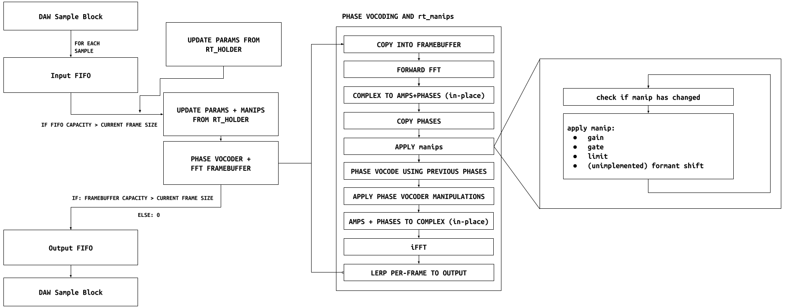

# THE RTSTFT FRAMEWORK

## Abstract
- What is it?
  - Pure C Library
  - A core STFT algorithm with several methods for manipulation
    - Per-bin manipulations, i.e. gating, limiting, muting
    - Phase vocoder based pitch-shifting
    - Freeform phase manipulation for effects akin to phase chorus
    - More to come...
  - A scripting language, rt_cmd, for precise control of these parameters
    - Includes a custom command parser
- What can it do?
  - User level manipulation of FFT bins, both amplitude and phase
    - Sonically akin to filtration, but with audible artifacts that can be creatively exploited
  - Methods for adjusting the phase vocoder algorithm for creative results
    - phase chorus
    - "robotization", but with more control
  - Intended for users to get in deep and experiment with + corrupt their sounds

## Background & History
#### Motivation and philosophy behind creation
- Digital audio is stuck trying to emulate and outperform analog gear
- Very little emphasis on exploring the creative possibilities that are unique to digital sound processing algorithms
- Few spectral plugins that aren't extremely nebulous about their actual internal function
- Very few creative plugins in general that emphasize surgical precision
- Absolutely no spectral plugins that allow direct interface with their underlying algorithms (to my knowledge)
  - RTSTFT is designed for user-level manipulation of individual FFT bins
- Also intended as a lightweight and friendly introduction to command-line syntax
  - A skill I think everyone deserves to be taught but lacks easily available resources for beginners
#### History of spectral audio
- Fourier transform began as a method for thermodynamic analysis
- Equalizers began as audio applications of principles used in electrical engineering
  - By their nature, smooth and somewhat imprecise (which is generally pleasing to the ear)
- Vocoders may be the first discretized audio processor
  - Utilized filters to isolate frequency bands for individual processing
- With the advent of modern computers, the DFT could be performed real-time
  - H910 Harmonizer
  - AutoTune (started out as oil location)
  - Phase vocoding for cell phones
  - JPEGs! (DCT)

## Implementation
### Overview

### Mathematics
##### Definitions 
Starting with a chosen FFT frame size $N$,  take the following definitions:
$$\text{frame size} = N\hspace{5mm}\text{frame count}=m $$
$$\text{overlap factor}=F_{overlap} \hspace{5mm} \text{scaling ratio}=S$$
$$\text{input sequence}     = x[n]\hspace{5mm}\text{output sequence}    = y[n]$$
$$\text{analysis hop}       = hop_a = \frac{N}{F_{overlap}}$$
$$\text{analysis hop}       = hop_s = \text{round}({S * hop_a})     $$

#### Calculations 
The equation for the output is:
$$y[n] = \sum_{i=0}^{m-1}=O_{i,(n - hop_s)} * (u[n - i * hop_s] - u[n - i * hop_s - N])$$

where $m$ is the number of frames, $O$ is the two-dimensional array of processed FFT frames, and $u[n]$ is the unit step function, defined as:
$$u[n] = \begin{cases} 1 & n \ge 0 \\ 0 & n < 0 \end{cases}$$

### rt_cmd

#### syntax

Limit the amplitude of bins 25 through 60 (inclusive) to $\pm0.5$, where amplitude is measured in the normal DSP convention of $[-1,1]$:

`limit 25-60 0.5`

Apply (roughly) the same limiting using decibels (dBFS):

`limit 25-60 -6`

Apply gain to bins 200-400 utilizing an exponential curve defined by $x^{10^{\text{input}}}$, where $\text{input}\in[-1,1]$ and $\text{input} = 0.5$:

`gain 200-400 -c 0.5 -12 -6`
